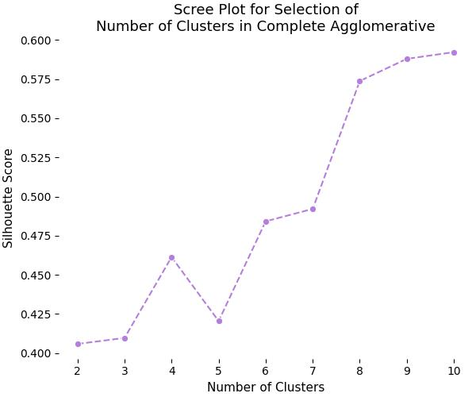

# Healthy Sleep Analysis <!-- omit in toc -->

## Abstract <!-- omit in toc -->
This project aims to perform a Statistical Analysis (EDA) and build a Machine Learning (ML) model to predict patient sleep quality based on their habits, quality of life, physical activity, and sleep disorders. The project is deployed on [Healthy Sleep](https://healthy-sleep.alexisaguilar.me/).

## Table of Contents <!-- omit in toc -->
- [About the Dataset](#about-the-dataset)
- [Exploratory Data Analysis](#exploratory-data-analysis)
  - [Basic Analysis](#basic-analysis)
  - [Correlation Matrix](#correlation-matrix)
  - [Principal Component Analysis](#principal-component-analysis)
  - [Factor Analysis](#factor-analysis)
- [Data Mining](#data-mining)
  - [Cluster Analysis](#cluster-analysis)
  - [Association Rules](#association-rules)
- [Machine Learning Models](#machine-learning-models)
- [Model API](#model-api)
- [Frontend](#frontend)
- [Installation and Usage](#installation-and-usage)
  - [Development and Local Testing](#development-and-local-testing)
  - [Deployment and Production Environment](#deployment-and-production-environment)
- [References](#references)

## About the Dataset
The dataset is taken from [Health and Sleep relation](https://www.kaggle.com/datasets/orvile/health-and-sleep-relation-2024). This dataset explores the relationship between sleep patterns and overall health. It includes detailed information on individual sleep habits, health metrics, and lifestyle factors, enabling analysis of how sleep quality and duration impact physical and mental well-being.

## Exploratory Data Analysis
The analysis can be found in [Statistical Analysis](./StatisticalAnalysis/StatisticalAnalysis.py) as an interactive notebook of [Marimo](https://github.com/marimo-team/marimo/) and deployed in [Statistical Analysis Notebook](https://healthy-sleep.alexisaguilar.me/StatisticalAnalysis/). The dataset consists of 374 instances (patients) which are described with 12 features (8 numerical and 4 categorical), the numerical features are non-normal and there is a dependency relationships in the categorical features.

### Basic Analysis 
Fifty percent of patients have a `Quality of Sleep` between 3 and 5, and a `Sleep Duration` of between 6.4 to 7.8 hours. This can be explained by considering that stress and physical activity influence sleep onset and the recovery of the body during sleep. Most of the patients are nurses, doctors or engineers, whose jobs or occupations involve high levels of stress, and most of them have a normal BMI and no sleep disorders.

It can be shown that `Quality of Sleep` of a patient is influenced by factors such as `Physical Activity Level`, `Stress Levels`, and `Sleep Duration`, where the first two relate to lifestyle and quality of life of a patient; additionally, the `Sleep Duration` has a significant influence and impact in determining how well one sleeps. `Occupation` (job) and `BMI Category` of a subject can alter both the quality and duration of sleep, but also the own quality of life of a patient; this dual influence or relationship makes them high-impact factors on overall well-being of a subject and, specifically, how they sleep.


Obesity and overweight are two conditions that increase the occurrence of conditions such as sleep apnea due to airway obstruction, which can be observed in how `Quality of Sleep` is diminished according to `BMI Category` of a subject, as well as the tendency to have more `Sleep Disorder` as weight increases.


### Correlation Matrix
Through the correlation matrix, it can be better appreciated how the different factors that constitute the lifestyle and quality of a subject interact to determine how well they sleep. Also noting that some features do not have a significant correlation with the `Quality of Sleep`, yet there is an indirect influence; such as `Blood Pressure` values that are correlated with `Age` and `Heart Rate`, and these features have a stronger influence on the `Quality of Sleep` of a patient.


### Principal Component Analysis
Performing a Principal Component Analysis (PCA) on the numerical features allows visualizing the patients based on their *sleep quality* (PC 1), *general health* (PC 2) and *physical condition* (PC 3).

Considering that aspects related to physical and sleep health are integrally related, it becomes natural to expect certain patterns when plotting the principal components using `BMI Category` and `Sleep Disorder` as categorical values. Specifically, it can be observed that having a high positive value in PC1 (better sleep health) and a low negative value in PC2 (greater youth) tends to result in normal weight and absence of sleep disorders.


### Factor Analysis 
Factor analysis is performed with numerical features and encoded categorical variables to encompass all possible interactions between features that can be explained through the factors. Using the mean of the communalities, it is found that the Factor Analysis model has moderate quality, meaning that not all variables are adequately explained by the factors. 


The interpretation of the resulted factors is given:
* *Factor 1*: Pertains to explaining the health of a patient (their precarity or deficiencies) based on their physical condition and sleep disorders.
* *Factor 2*: Is associated with the overall quality of sleep, how well one sleeps and recovers, also encompassing how having a stressful life affects sleep (high stress levels and hypertension).
* *Factor 3*: Is linked to the physical activity and activation levels of a patient and their connection to the presence of insomnia (possible relationship between the energy and mood someone has throughout the day).
* *Factor 4*: Does not provide relevant information or relationships.


## Data Mining
The full data mining process can be found in [Data Mining](./StatisticalAnalysis/DataMining.py) as an interactive Marimo notebook and deployed in [Data Mining Notebook](https://healthy-sleep.alexisaguilar.me/DataMining/). This notebook explains in detail each decision taken to perform the extraction of insights.

### Cluster Analysis
Using PCA in the processed dataset (encoded categorical features and MinMax scaler for numerical features), no clusters were found visually. This implies that it is necessary to apply feature engineering to create another kind of relationships between features, and using an appropriate metric could show better clusters in the dataset.


Agglomerative clustering is used in order to evaluate which linkage generates the best results using Gower distance as the metric (due to the presence of mixed data types, this metric has a better quality). And Silhouette score was chosen to measure the quality of the linkages and to compare them based on how well they separate and generate clusters.

Using the scree plots of the Silhouette score varying the number of clusters, the complete linkage tends to have better scores due to this linkage forms sphere-shape clusters. Therefore, clusters with patients more similar to each other.



Using the elbow method, agglomerative clustering with complete linkage and 8 clusters achieves a Silhouette score of 0.5737 which each cluster is well-defined and represents a distinct profile with possible similarities. The next profiles (brief description) are discovered:

* *Profile 1*: Middle-aged male professionals (avg. 42) in demanding office roles with 6.5 hours of sleep, moderate stress, overweight status, and frequent insomnia.

* *Profile 2*: Physically active middle-aged males (avg. 40) with high socioeconomic status, enjoying 7.5 hours of sleep, normal weight, and no sleep disorders.

* *Profile 3*: Young adult males (avg. 38) classified as obese with 7 hours of sleep and elevated stress, often experiencing sleep apnea or obesity-related insomnia.

* *Profile 4*: Young professional women (avg. 36) with balanced lifestyles, achieving 7.2 hours of sleep, normal weight, and low stress.

* *Profile 5*: Young male doctors (avg. 30) early in their careers with high stress levels and 6.8 hours of sleep despite maintaining a normal body weight.

* *Profile 6*: Established professional women (avg. 52) with high socioeconomic status, excellent sleep quality (8.4 hours), low stress, and a quiet lifestyle.

* *Profile 7*: Adult female educators (avg. 43) with demanding professions, 6.5 hours of sleep, and frequent insomnia despite regular physical activity.

* *Profile 8*: Experienced nurses (avg. 53) with active lifestyles and 7 hours of sleep, though classified as overweight and prone to obstructive sleep apnea.

### Association Rules
With a minimum support of 15% (approximately 56 patients), confidence of 90% and lift of 5 (these metrics create strong rules), two relevante rules were discovered for explaining and showing some associations between the dataset and real facts:

* *Rule 1*: Reflects the conditions for achieving the best rest/sleep and having a normal heart rate, which are having low stress levels, sleeping between 7 and 9 hours, and being between 50 and 60 years old. Overall, this rule explains how sleeping well and not living stressed impacts how well one sleeps.
    $$ \text{Sleep Duration} \in [7,9] , \text{Age} \in [50,60], \text{Stress Level} \in [2,5] \implies \\ \text{Heart Rate} \in [60,80] , \text{Quality of Sleep} \in [8,10] $$

* *Rule 2*: Shows the association that exists between having a precarious health status and the habits of an subject. The most relevant finding is that it verifies the pattern that being overweight implies being sedentary and having low physical activity, and that this adds to the occurrence of insomnia, resulting in fewer hours of sleep.
    $$ \text{BMI Category is Overweight} , \text{Sleep Disorder is Insomnia} \implies \\ \text{Sleep Duration} \in [6,7] , \text{Daily Steps} \in [5000,7000] , \\ \text{Heart Rate} \in [60,80] , \text{Physical Activity Level} \in [20,45] $$

## Machine Learning Models
The detailed process for model definition and creation can be found in [ModelsTraining.ipynb](./MachineLearning/ModelsTraining.ipynb). Four different classification models are proposed, trained with weighted F1 (due to the notable class imbalance in the dataset) and fine-tuned using [Optuna](https://optuna.org/) in order to predict the `Quality of Sleep` of a patient. Derived from the [Statistical Analysis](#exploratory-data-analysis), non-linear models (SVM, Random Forest, and AdaBoost) and a linear model (Logistic Regression) are employed, with the latter serving as a baseline and comparison point for the other models.

Using Logistic Regression as a baseline allows for the evaluation that the classes were not entirely linearly separable. However, the addition of non-linear elements (polynomial operations or non-linear functions) enables the classes to be correctly separated and classified (based on the confusion matrices), where errors decrease and metrics increase considerably. Furthermore, these non-linear models generate more consistent and robust predictions; specifically, when they do not predict the correct class, their prediction differs by at most one class or level (this comparison method is valid because `Quality of Sleep` is an ordinal variable).


Based on the results and their subsequent analysis performed in [ModelsTraining.ipynb](./MachineLearning/ModelsTraining.ipynb), the AdaBoost model is chosen for production deployment, as its metrics are high and its predictions are consistent. These characteristics are a result of how this ensemble is trained, along with appropriate fine-tuning.


## Model API 
A RESTful API was implemented using [FastAPI](https://fastapi.tiangolo.com/) to classify incoming patient requests. The API utilizes a POST method to process the patient features via the model developed in the [Machine Learning Models](#machine-learning-models) section. For long-term model evaluation, the patient features and their predicted classification are logged into a PostgreSQL database. 

The main entrypoint for the API is the `POST /api` endpoint, where the request body contains the patient features. The response includes the predicted level and name of the quality of sleep of the patient.

## Frontend
A simple, minimalist frontend was developed using [Vue.js](https://vuejs.org/) and deployed in [Interactive Frontend](https://healthy-sleep.alexisaguilar.me/). It features a form designed to capture the input features of the patient and display the predicted level of sleep quality in an additional field.

## Installation and Usage
This project was deployed following the procedures outlined in the [How To Deploy Your Project](https://github.com/alexisuaguilaru/HowToDeployYourProject) guide. The deploy utilizes [Hetzner](https://hetzner.com) for cloud hosting, with [Cloudflare](https://www.cloudflare.com) managing the domain and [Traefik](https://traefik.io/traefik) serving as the reverse proxy.

1. Clone the repository and move to the project directory:
```bash
git clone https://github.com/alexisuaguilaru/HealthySleep.git
cd HealthySleep
```

### Development and Local Testing
1. Copy the `.env_example` file to `.env` and change their values optionally:
```bash
cp .env_example .env
```

2. Build and start the Docker network and containers:
```bash
docker network create traefik_proxy
docker compose up --profile dev -d --build
```

* Access the frontend by navigating to: http://localhost:8080/
* Access the EDA by navigating to: http://localhost:5050/
* Access the Data Mining by navigating to: http://localhost:5151/

### Deployment and Production Environment
1. Copy the `.env_example` file to `.env` and change their values (especially use your `DOMAIN` value):
```bash
cp .env_example .env
```

1. Build and start the Docker network and containers:
```bash
docker network create traefik_proxy
docker compose up --profile prod -d --build
```

* Access the frontend by navigating to: https://${DOMAIN}/
* Access the EDA by navigating to: https://${DOMAIN}/StatisticalAnalysis
* Access the Data Mining by navigating to: https://${DOMAIN}/DataMining

## References
* [1] Orvile. (2024). *Health and Sleep Relation* [Dataset]. Kaggle. https://www.kaggle.com/datasets/orvile/health-and-sleep-relation-2024
* [2] Malhotra, A., Heilmann, C. R., Banerjee, K. K., Dunn, J. P., Bunck, M. C., & Bednarik, J. (2024). *Weight reduction and the impact on apnea-hypopnea index: A systematic meta-analysis. Sleep Medicine*, 121, 26–31. https://doi.org/10.1016/j.sleep.2024.06.014
* [3] Chrysant, S. G. (2024). *Effects of physical activity on sleep quality and wellbeing. Hospital Practice*, 52(1–2), 13–18. https://doi.org/10.1080/21548331.2024.2320069 
* [4] Mao, Y., Raju, G., & Zabidi, M. A. (2023). *Association Between Occupational Stress and Sleep Quality: A Systematic Review. Nature and Science of Sleep*, 15, 931–947. https://doi.org/10.2147/NSS.S431442 
* [5] Kanthraj, H. V., Kalaburgi, R. A., & VeenaKanthraj, H. (2025). *Association Between Stress and Sleep Disorders Among Working Adults. Internat. J. Life Sciences, Biotechnol. & Pharma Res*, 14(1), 772-780.


## Author, Affiliation and Contact <!-- omit in toc -->
Alexis Aguilar [Student of Bachelor's Degree in "Tecnologías para la Información en Ciencias" (Data Science) at Universidad Nacional Autónoma de México [UNAM](https://www.unam.mx/)]: alexis.uaguilaru@gmail.com

Project developed for the subjects "[Multivariate Statistics](https://github.com/alexisuaguilaru/EstadisticaMultivariada)" and "Data Mining" taught in semester 2026-1. 

## License <!-- omit in toc -->
Project under [MIT License](LICENSE)