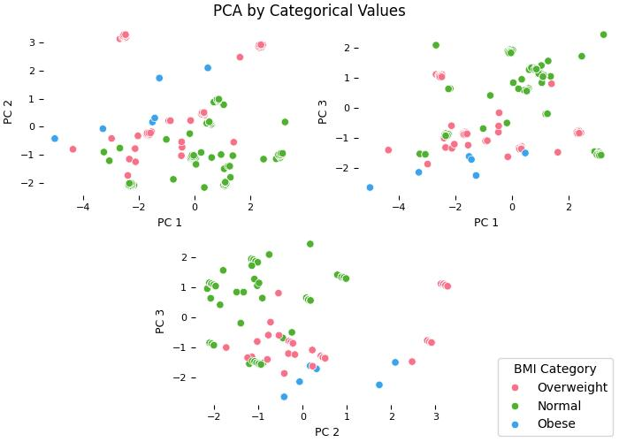
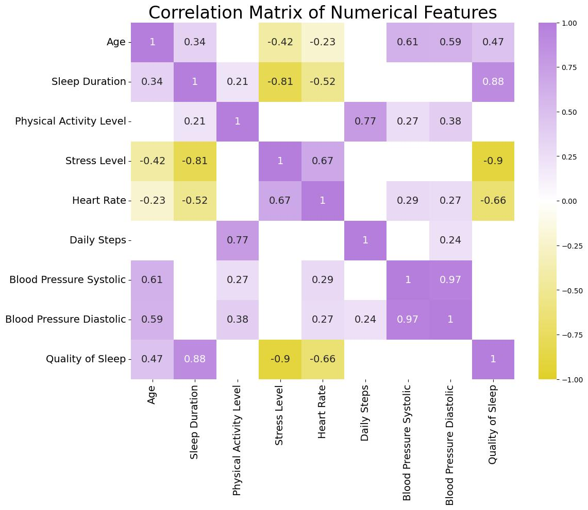
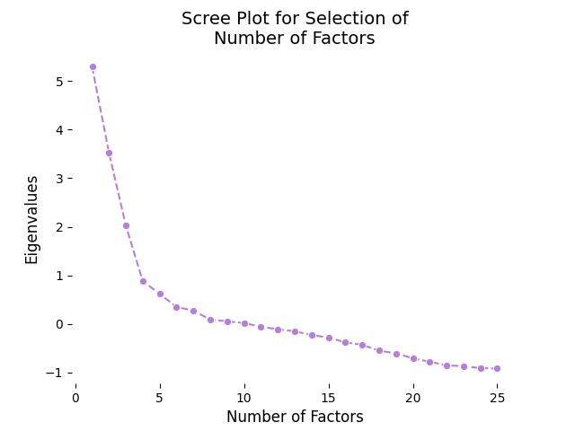
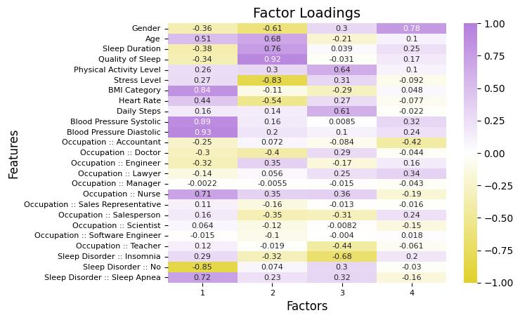
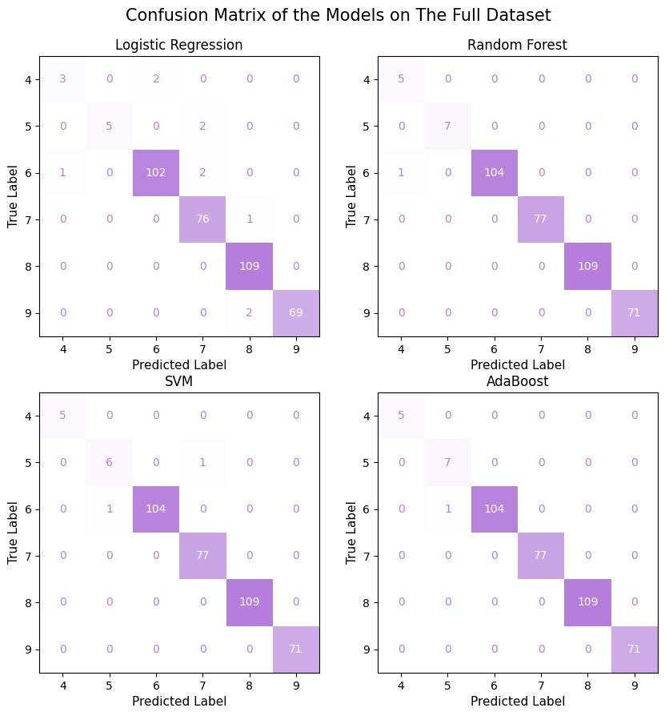
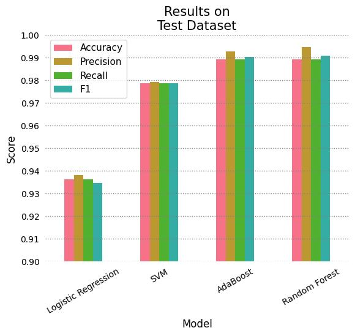

# Healthy Sleep Analysis

## Abstract
This project aims to perform a Statistical Analysis (EDA) and build a Machine Learning (ML) model to predict patient sleep quality based on their habits, quality of life, physical activity, and sleep disorders.

## About the Dataset
The dataset is taken from [Health and Sleep relation](https://www.kaggle.com/datasets/orvile/health-and-sleep-relation-2024). This dataset explores the relationship between sleep patterns and overall health. It includes detailed information on individual sleep habits, health metrics, and lifestyle factors, enabling analysis of how sleep quality and duration impact physical and mental well-being.

## Exploratory Data Analysis
The analysis can be found in [Statistical Analysis](./StatisticalAnalysis/StatisticalAnalysis.py) as an interactive notebook of [Marimo](https://github.com/marimo-team/marimo/). The dataset consists of 374 instances (patients) which are described with 12 features (8 numerical and 4 categorical), the numerical features are non-normal and there is a dependency relationships in the categorical features.

Fifty percent of patients have a Quality of Sleep between 6 and 8, and a Sleep Duration of between 6.4 to 7.8 hours. This can be explained by considering that stress and physical activity influence sleep onset and the recovery of the body during sleep. Most of the patients are nurses, doctors or engineers, whose jobs or occupations involve high levels of stress, and most of them have a normal BMI and no sleep disorders.

It can be shown that Quality of Sleep of a patient is influenced by factors such as Physical Activity Level, Stress Levels, and Sleep Duration, where the first two relate to lifestyle and quality of life of a person; additionally, the Sleep Duration has a significant influence and impact in determining how well one sleeps. Occupation (job) and BMI Category of a person can alter both the quality and duration of sleep, but also the own quality of life of a patient; this dual influence or relationship makes them high-impact factors on overall well-being of a person and, specifically, how they sleep.


Obesity and overweight are two conditions that increase the occurrence of conditions such as sleep apnea due to airway obstruction, which can be observed in how Quality of Sleep is diminished according to BMI Category of a person, as well as the tendency to have more Sleep Disorder as weight increases.


Performing a Principal Component Analysis (PCA) on the numerical features allows visualizing the patients based on their sleep quality (PC 1), general health (PC 2) and physical condition (PC 3).
Considering that aspects related to physical and sleep health are integrally related, it becomes natural to expect certain patterns when plotting the principal components using BMI Category and Sleep Disorder as categorical values. Specifically, it can be observed that having a high positive value in PC1 (better sleep health) and a low negative value in PC2 (greater youth) tends to result in normal weight and absence of sleep disorders.




Through the correlation matrix, it can be better appreciated how the different factors that constitute the lifestyle and quality of a person interact to determine how well they sleep. Also noting that some features do not have a significant correlation with the Quality of Sleep, yet there is an indirect influence; such as blood pressure values that are correlated with Age and Heart Rate, and these features have a stronger influence on the Quality of Sleep of a person.



Factor analysis is performed with numerical features and encoded categorical variables to encompass all possible interactions between features that can be explained through the factors. Using the mean of the communalities, it is found that the Factor Analysis model has moderate quality, meaning that not all variables are adequately explained by the factors. Although some of the variances of the variables are adequately explained by the factors (such as Gender, Quality of Sleep, Blood Pressure, Sleep Disorder, BMI Category, Age, Physical Activity), some others are not (such as Occupation, Daily Steps).



The interpretation of the resulted factors is given:
* *Factor 1*: Pertains to explaining the health of a patient (their precarity or deficiencies) based on their physical condition and sleep disorders.
* *Factor 2*: Is associated with the overall quality of sleep, how well one sleeps and recovers, also encompassing how having a stressful life affects sleep (high stress levels and hypertension).
* *Factor 3*: Is linked to the physical activity and activation levels of a patient and their connection to the presence of insomnia (possible relationship between the energy and mood someone has throughout the day).
* *Factor 4*: Does not provide relevant information or relationships.



## Data Mining
The full data mining process can be found in [Data Mining](./StatisticalAnalysis/DataMining.py) as an interactive Marimo notebook. This notebook explains in detail each decision taken to perform the extraction of insights.

### Cluster Analysis
Using K-Means on the dataset with encoded categorical features, without standarization and Euclidean distance, 6 profiles were discovered from the centroids of each clusters:
* **Profile 1**: Consists mostly of women (aged 46) who maintain a balanced lifestyle with low stress, moderate physical activity, and normal vitals (blood pressure and heart rate). Despite achieving good sleep duration and rest, they show a tendency toward overweight resulting in sleep apnea. They are typically accountants and nurses.
* **Profile 2**: Consists of individuals (aged 43–44) experiencing moderate stress and insomnia, which severely limits their sleep to 6.5 hours. This stress, combined with low physical activity, leads to overweight and slightly elevated blood pressure and heart rate. They are frequently managers and teachers, professions known for high constant pressure.
* **Profile 3**: Primarily women (aged 48–49) characterized by a highly stressful life linked to a deplorable sleep quality due to sleep apnea. This poor rest causes arrhythmias (high blood pressure and heart rate). Crucially, their high physical activity levels likely benefit their overall condition despite the stress. They are mostly nurses.
* **Profile 4**: Consists of men (aged 36) who manage their moderate stress well, allowing for ideal rest and recovery. They maintain some physical activity and do not suffer from any sleep disorders or overweight/obesity. They are typically doctors and lawyers who have established a stable, controlled professional life.
* **Profile 5**: Dominated by men (aged 35) suffering from deplorable sleep quality due to sleep disorders. This directly results in a lack of willingness to engage in physical activity and a resulting overweight tendency, accompanied by elevated blood pressure and heart rate. They work in demanding fields like software engineering and sales.
* **Profile 6**: Includes individuals (aged 42–43) who enjoy moderate sleep quality and are not overweight or affected by sleep disorders. They have low physical activity levels, which results in slightly elevated (but non-alarming) vitals. They are primarily engineers and scientists, professions where work demands limit the time available for exercise.

### Association Rules
With a minimum support of 15%, confidence of 90% and lift of 5, two relevante rules were discovered for explaining and showing some associations between the data and real facts:
* **Rule 1**: Reflects the conditions for achieving the best rest/sleep and having a normal heart rate, which are having low stress levels, sleeping between 7 and 9 hours, and being between 50 and 60 years old. Overall, this rule explains how sleeping well and not living stressed impacts how well one sleeps.
* **Rule 2**: Shows the association that exists between having a precarious health status and the habits of an individual. The most relevant finding is that it verifies the pattern that being overweight implies being sedentary and having low physical activity, and that this adds to the occurrence of insomnia, resulting in fewer hours of sleep.

## Machine Learning Models
The detailed process for model definition and creation can be found in [ModelsTraining.ipynb](./MachineLearning/ModelsTraining.ipynb). Four different classification models are proposed, trained with weighted F1 (due to the notable class imbalance in the dataset) and fine-tuned using [Optuna](https://optuna.org/) in order to predict the `Quality of Sleep` of a patient. Derived from the [Statistical Analysis](#exploratory-data-analysis), non-linear models (SVM, Random Forest, and AdaBoost) and a linear model (Logistic Regression) are employed, with the latter serving as a baseline and comparison point for the other models.

Using Logistic Regression as a baseline allows for the evaluation that the classes were not entirely linearly separable. However, the addition of non-linear elements (polynomial operations or non-linear functions) enables the classes to be correctly separated and classified (based on the confusion matrices), where errors decrease and metrics increase considerably. Furthermore, these non-linear models generate more consistent and robust predictions; specifically, when they do not predict the correct class, their prediction differs by at most one class or level (this comparison method is valid because `Quality of Sleep` is an ordinal variable).



Based on the results and their subsequent analysis performed in [ModelsTraining.ipynb](./MachineLearning/ModelsTraining.ipynb), the AdaBoost model is chosen for production deployment, as its metrics are high and its predictions are consistent. These characteristics are a result of how this ensemble is trained, along with appropriate fine-tuning.



## Model API 
A RESTful API was implemented using [FastAPI](https://fastapi.tiangolo.com/) to classify incoming patient requests. The API utilizes a POST method to process the patient features via the model developed in the [Machine Learning Models](#machine-learning-models) section. For long-term model evaluation, the patient features and their predicted classification are logged into a PostgreSQL database. 

The main entrypoint for the API is the `POST /Classify` endpoint, where the request body contains the patient features. The response includes the predicted level and name of the quality of sleep of the patient.

## Installation and Usage
1. First it has to clone the repository and move to the project directory:
```bash
git clone https://github.com/alexisuaguilaru/HealthySleep.git
cd HealthySleep
```

2. Preferably using a virtual environment of Python, install the libraries required for the project with:
```bash 
pip install -r requirements.txt
```

### Statistical Analysis (EDA and Data Mining)
1. Run and view the Marimo notebooks with the following commands:
```bash
marimo run StatisticalAnalysis/StatisticalAnalysis.py
marimo run StatisticalAnalysis/DataMining.py
```

### Machine Learning Models
1. Open and run the Jupyter notebook with the following command:
```bash
jupyter notebook MachineLearning/ModelsTraining.ipynb
```

## Author, Affiliation and Contact
Alexis Aguilar [Student of Bachelor's Degree in "Tecnologías para la Información en Ciencias" at Universidad Nacional Autónoma de México [UNAM](https://www.unam.mx/)]: alexis.uaguilaru@gmail.com

Project developed for the subjects "[Multivariate Statistics](https://github.com/alexisuaguilaru/EstadisticaMultivariada)" and "Data Mining" for the class taught in semester 2026-1.

## License
Project under [MIT License](LICENSE)