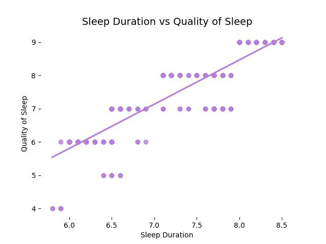

# Healthy Sleep Analysis

## Abstract
Statistical analysis of sleep quality of patients based on their habits, quality of life, physical activity and sleep disorders.

## About the Dataset
The dataset is taken from [Health and Sleep relation](https://www.kaggle.com/datasets/orvile/health-and-sleep-relation-2024). This dataset explores the relationship between sleep patterns and overall health. It includes detailed information on individual sleep habits, health metrics, and lifestyle factors, enabling analysis of how sleep quality and duration impact physical and mental well-being.

## Exploratory Data Analysis
The analysis can be found in [Statistical Analysis](./StatisticalAnalysis/StatisticalAnalysis.py) as an interactive notebook of [Marimo](https://github.com/marimo-team/marimo/). The dataset consists of 374 instances (patients) which are described with 12 features (8 numerical and 4 categorical), the numerical features are non-normal and there is a dependency relationships in the categorical features.

Fifty percent of patients have a Quality of Sleep between 6 and 8, and a Sleep Duration of between 6.4 to 7.8 hours. This can be explained by considering that stress and physical activity influence sleep onset and the recovery of the body during sleep. Most of the patients are nurses, doctors or engineers, whose jobs or occupations involve high levels of stress, and most of them have a normal BMI and no sleep disorders.

It can be shown that Quality of Sleep of a patient is influenced by factors such as Physical Activity Level, Stress Levels, and Sleep Duration, where the first two relate to lifestyle and quality of life of a person; additionally, the Sleep Duration has a significant influence and impact in determining how well one sleeps. Occupation (job) and BMI Category of a person can alter both the quality and duration of sleep, but also the own quality of life of a patient; this dual influence or relationship makes them high-impact factors on overall well-being of a person and, specifically, how they sleep.



Obesity and overweight are two conditions that increase the occurrence of conditions such as sleep apnea due to airway obstruction, which can be observed in how Quality of Sleep is diminished according to BMI Category of a person, as well as the tendency to have more Sleep Disorder as weight increases.


Performing a Principal Component Analysis (PCA) on the numerical features allows visualizing the patients based on their sleep quality (PC 1), general health (PC 2) and physical condition (PC 3).
Considering that aspects related to physical and sleep health are integrally related, it becomes natural to expect certain patterns when plotting the principal components using BMI Category and Sleep Disorder as categorical values. Specifically, it can be observed that having a high positive value in PC1 (better sleep health) and a low negative value in PC2 (greater youth) tends to result in normal weight and absence of sleep disorders.


Through the correlation matrix, it can be better appreciated how the different factors that constitute the lifestyle and quality of a person interact to determine how well they sleep. Also noting that some features do not have a significant correlation with the Quality of Sleep, yet there is an indirect influence; such as blood pressure values that are correlated with Age and Heart Rate, and these features have a stronger influence on the Quality of Sleep of a person.


Factor analysis is performed with numerical features and encoded categorical variables to encompass all possible interactions between features that can be explained through the factors. Using the mean of the communalities, it is found that the Factor Analysis model has moderate quality, meaning that not all variables are adequately explained by the factors. Although some of the variances of the variables are adequately explained by the factors (such as Gender, Quality of Sleep, Blood Pressure, Sleep Disorder, BMI Category, Age, Physical Activity), some others are not (such as Occupation, Daily Steps).


The interpretation of the resulted factors is given:
* *Factor 1*: Pertains to explaining the health of a patient (their precarity or deficiencies) based on their physical condition and sleep disorders.
* *Factor 2*: Is associated with the overall quality of sleep, how well one sleeps and recovers, also encompassing how having a stressful life affects sleep (high stress levels and hypertension).
* *Factor 3*: Is linked to the physical activity and activation levels of a patient and their connection to the presence of insomnia (possible relationship between the energy and mood someone has throughout the day).
* *Factor 4*: Does not provide relevant information or relationships.


## Installation and Usage
1. First it has to clone the repository and move to the project directory:
```bash
git clone https://github.com/alexisuaguilaru/HealthySleep.git
cd HealthySleep
```

2. Preferably using a virtual environment of Python, install the libraries required for the project with:
```bash 
pip install -r requirements.txt
```

3. Finally, run and view the Marimo notebook with the following command:
```bash
marimo run StatisticalAnalysis/StatisticalAnalysis.py
```

## Author, Affiliation and Contact
Alexis Aguilar [Student of Bachelor's Degree in "Tecnologías para la Información en Ciencias" at Universidad Nacional Autónoma de México [UNAM](https://www.unam.mx/)]: alexis.uaguilaru@gmail.com

Project developed for the subjects "[Multivariate Statistics](https://github.com/alexisuaguilaru/EstadisticaMultivariada)" and "Data Mining" for the class taught in semester 2026-1.

## License
Project under [MIT License](LICENSE)