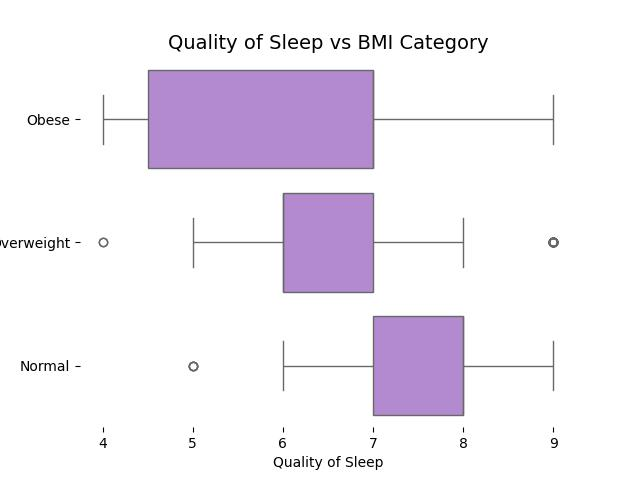

# Healthy Sleep Analysis

## Abstract
Statistical analysis of sleep disorders based on habits patients.

## About the Dataset
The dataset is taken from [Health and Sleep relation](https://www.kaggle.com/datasets/orvile/health-and-sleep-relation-2024). This dataset explores the relationship between sleep patterns and overall health. It includes detailed information on individual sleep habits, health metrics, and lifestyle factors, enabling analysis of how sleep quality and duration impact physical and mental well-being.

## Exploratory Data Analysis
The analysis can be found in [Statistical Analysis](./StatisticalAnalysis/StatisticalAnalysis.py) as an interactive notebook of [Marimo](https://github.com/marimo-team/marimo/). The dataset consists of 374 instances (patients) which are described with 12 features (8 numerical and 4 categorical), the numerical features are non-normal and there is a dependency relationships in the categorical features.

There is a positive correlation between `Quality of Sleep` and `Sleep Duration`, so their relation could be explain with a unique factor (as a strong relation between these events) or as a consequence of something else (like medical or physical): 

Furthermore,  `Quality of Sleep` and `Sleep Duration` are also influenced by `Occupation`, `BMI Category` and `Sleep Disorder` because they are associated to the style of life and physical condition which have an interaction with the recovery and sleep health:

Performing a Principal Component Analysis (PCA) on the numerical features allows visualizing the patients based on their sleep quality (PC 1), general health (PC 2) and physical condition (PC 3). And it can also be seen the interaction with the categorical features where `Sleep Disorder` follows a slight pattern, this means that a healthy life tends to have less sleep disorders.

## Author, Affiliation and Contact
Alexis Aguilar [Student of Bachelor's Degree in "Tecnologías para la Información en Ciencias" at Universidad Nacional Autónoma de México [UNAM](https://www.unam.mx/)]: alexis.uaguilaru@gmail.com

Project developed for the subjects "[Multivariate Statistics](https://github.com/alexisuaguilaru/EstadisticaMultivariada)" and "Data Mining" for the class taught in semester 2026-1.

## License
Project under [MIT License](LICENSE)